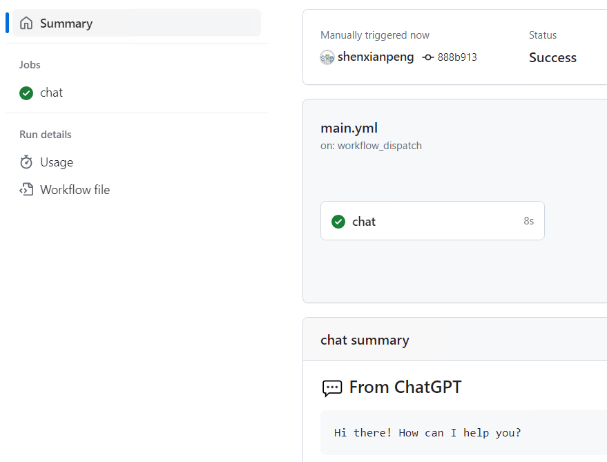

# Run ChatGTP with GitHub Action



## Get started

```bash
# Generate OPENAI_API_KEY from https://platform.openai.com/account/api-keys
export OPENAI_API_KEY="your-openai-api-key"
python3 main.py --prompt "Hello ChatGPT!"
```

## Get example code

Visit https://platform.openai.com/examples -> Q&A -> Open in Playground
